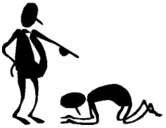
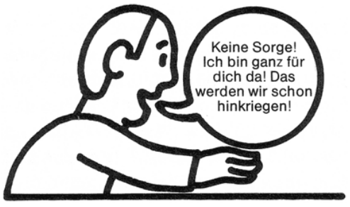

## Anthropologie und Problemfelder menschlichen Handelns
# Erziehung

## Anthropologie
# Jean-Jacques Rousseau

Ist der Mensch gut oder böse?<!-- .element: class="frage" -->

> Die Menschen sind böse; eine traurige und fortdauernde Erfahrung erübrigt den Beweis; jedoch, der Mensch ist von Natur aus gut, ich glaube, es nachgewiesen zu haben; […] Man bewundere die menschliche Gesellschaft, soviel man will, es wird deshalb nicht weniger wahr sein, dass sie die Menschen notwendigerweise dazu bringt, sich in dem Maße zu hassen, in dem ihre Interessen sich kreuzen, außerdem sich wechselseitig scheinbare Dienste zu erweisen und in Wirklichkeit sich alle vorstellbaren Übel zuzufügen.  <!-- .element: class="fragment"  --> <!-- Institutionelle Vernunft ist leer. -->

Jean-Jacques Rousseau (1712-1778) <!-- .element: class="rechts" -->

Wie positionieren sich die Kirchen und Islamverbände in dieser Frage? <!-- .element: class="frage fragment" -->

> Immer folgt man dem Usus, nie dem eigenen Genius. <!-- .element: class="fragment" --><!-- Die Meinung von anderen soll man nicht achten, und sich von der Gesellschaft nicht beeinflussen lassen, weil die nur irritiert.-->

Jean-Jacques Rousseau (1712-1778)<!-- .element: class="rechts" -->

## Anthropologie
# Jean-Jacques Rousseau

* Extrem auffällig, egozentrisch, provokant, direkt, aktivierend.
* Nicht gut Freund mit der Kirche, wurde aber nie eingesperrt.
* Die Institutionen (leer) und die Kunst (oberflächlich) sind für ihn die Gründe für das Schlechte im Menschen. 

Zitate, für die er bekannt ist:

> Der erste, der ein Stück Land einzäunte und sagte: das gehört mir, war der Gründer des Staates und der Ungleichheit.
 
> Der Gehorsam gegenüber dem Gesetz, das man sich vorgeschrieben hat, ist Freiheit.

## Erziehung
# Gute Erziehung

Definieren Sie, was gute Erziehung ist. <!-- .element: class="frage" -->

Was zeichnet gute Erziehung aus? <!-- .element: class="frage" -->

## Erziehung
# Erziehungsstile - Einzelarbeit

Nach Wikipedia gibt es zehn Erziehungsstile und -konzepte. Erarbeiten Sie ihren Textausschnitt so, dass sie ihn präsentieren können.  <!-- .element: class="frage" -->

Mit welchem Erziehungsstil wird hier erzogen? <!-- .element: class="frage" -->

## Erziehung
# Erziehungsstile - ala Speed Dating

Bilden Sie zwei Tischreihen so, dass Sie sich jeweils einer Person gegenübersitzen. <!-- .element: class="frage" -->
Besprechnen Sie Ihre jeweiligen Erziehungsstile/konzepte <!-- .element: class="frage" -->

* Erläutern Sie sich gegenseitig die Erziehungsstile.
* Erfinden Sie einen Fall, in dem ein Elternteil auf diese Weise handelt.
* Kennen Sie jemanden, der so erzogen wurde?
* Wurde einer von Ihnen so erzogen?
* Was ist an diesem Erziehungsstil positiv oder negativ?

## Erziehung
# Paternalistische Erziehung

> Als **paternalistisch** wird umgangssprachlich auch eine Handlung bezeichnet, wenn sie gegen den Willen, aber auf das vermeintliche Wohl eines anderen gerichtet ist. Paternalistische Regelungen werden von den Adressaten häufig als Bevormundung angesehen.

Wikipedia <!-- .element: class="rechts" -->

* Beispiele: Anschnallpflicht, Schulpflicht, [Nudges](https://m.grin.com/document/206500).
* Alternativen: liberale, demokratische, laissez-faire, permissive Erziehung, gewaltfreie Kommunikation.

## Erziehung
# Jean-Jacques Rousseau

Seiner Meinung nach müssen die bösen Einflüsse von Kindern ferngehalten werden, ihr ursprüngliches Begegnen mit der Welt gefördert und vor allem auf alle Zwänge und moralisierende Vorschriften verzichtet werden.
Das ist keine Laissez-faire-Pädagogik, sondern eine radikale Hinwendung zur eigenständigen Individualität, eine Absage an Einflussnahme durch kirchliche oder staatlichen Institutionen.

Nennen Sie die Aspekte guter Erziehung, die Rousseau in diesem Zitat nennt.  <!-- .element: class="frage" -->
Bewerten Sie diese Aspekte.  <!-- .element: class="frage" -->

## Erziehung
# Vorbild

[Gewaltvideos beenden Lehrer-Karriere](http://www.stuttgarter-nachrichten.de/inhalt.death-metal-gewaltvideos-beenden-lehrer-karriere.1ca78002-2302-4193-96b5-f356103c5f8b.html)

Darf ein Lehrer Death-Metal-Sänger sein?  <!-- .element: class="frage" -->

Wo sind Sie ein Vorbild?   <!-- .element: class="frage fragment" -->

## Erziehung
# Vorbild

> Meine Herren, ein Wegweiser geht doch auch nicht den Weg, den er zeigt.

Max Scheler <!-- .element: class="rechts" -->

> Kleine Jungs brauchen starke Männer

Wolfgang Bergmann "Kleine Jungs große Not. Wie wir ihnen Halt geben."  <!-- .element: class="rechts" -->

Bearbeiten Sie den Textauszug aus Bergmanns Werk. <!-- .element: class="frage" -->

* Welches Problem analysiert Bergmann und welchen Anspruch stellt er an sein Werk? <!-- ADS. Ursache klären. -->
* Was zeichnet nach Bergmann die Familien seiner Patienten aus? <!-- Eltern haben von Medien hervorgerufene Sehnsuchtsgefühle, Kinder fungieren als Ausgleich verfehlter Selbsterwartung. Daher Erwartungsdruck und Harmoniebedürfnis + Kind im Zentrum. -->
* Welche Auswirkung hat die klassische Rollenverteilung?
* Was ist mit dem "Angebot zur Regression" gemeint?
* Was können die Eltern tun, um zu helfen?
* Welche Rolle spielt die Digitale Welt?
